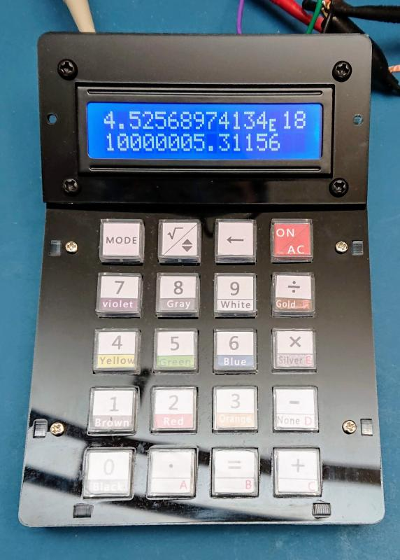
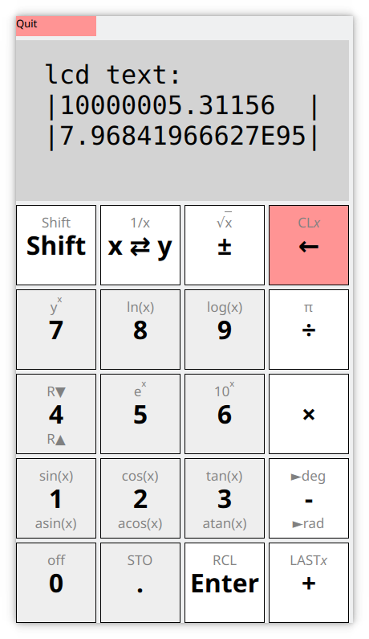
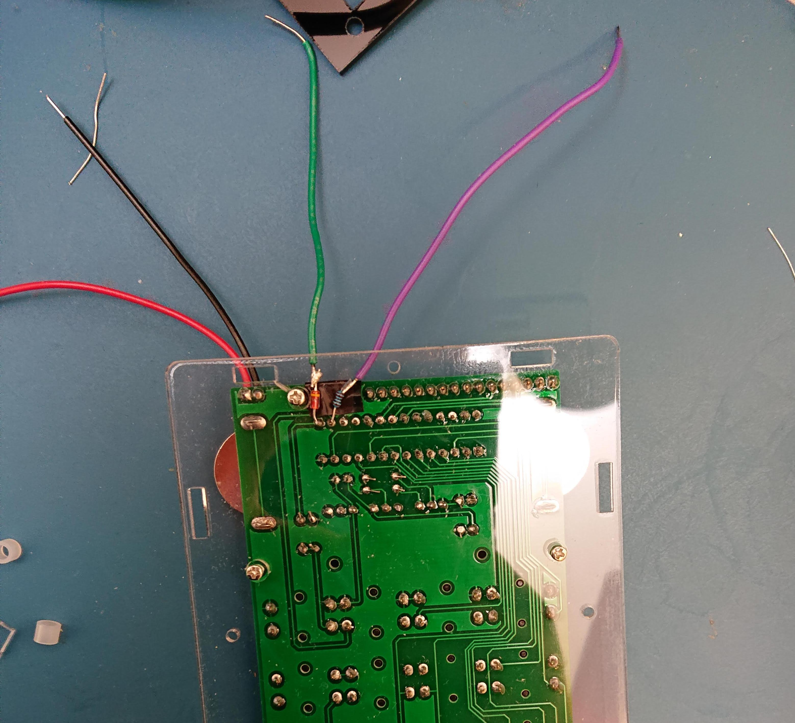
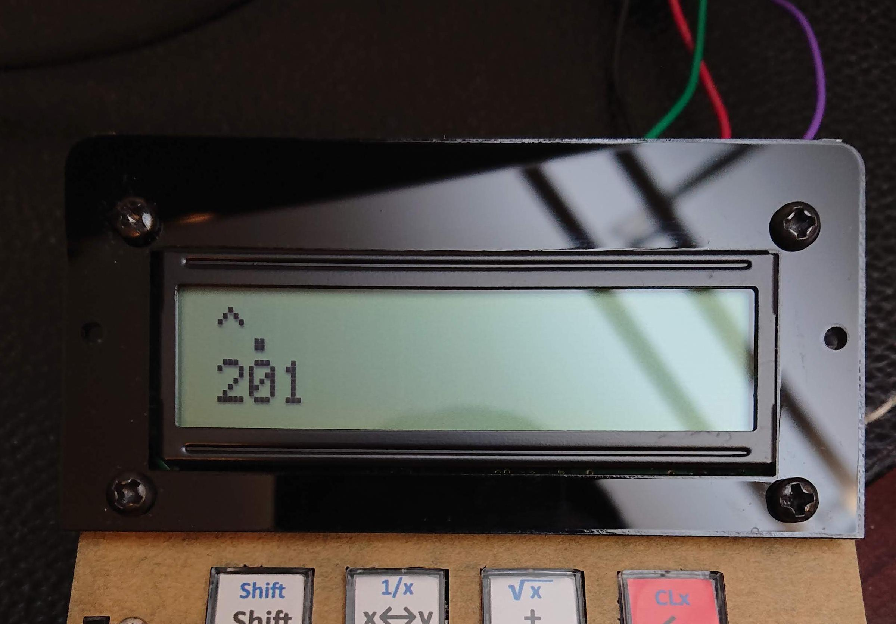

# STC DIY Calculator Firmware

This is a replacement firmware for the [diyleyuan calculator kit](http://www.diyleyuan.com/jc/L8Q.html). The calculator kit is available for purchase for less than $13 shipped from eBay by searching for "diy calculator kit" (price has increased recently, currently closer to $18 shipped). You will have to solder the kit yourself (see "hardware connections" below). The calculator uses an STC IAP15W413AS microcontroller (an 8051 instruction set-compatible microcontroller) with a built-in serial-port bootloader. See the series [summary](http://www.stcmicro.com/datasheet/STC15W408AS_Features.pdf) and full english [datasheet](https://www.stcmicro.com/datasheet/STC15F2K60S2-en.pdf). This project uses [SDCC](http://sdcc.sourceforge.net/) to compile the C code and [stcgal](https://github.com/grigorig/stcgal) to load the new firmware.

The replacement firmware supports floating-point calculations (using 18 decimal digits plus exponent for arithmetic) with a 4-level RPN stack. Functions include basic arithmetic as well as log(), exp(), y^x, 1/x and sqrt(), all in floating point. (The original firmware supported only fixed-point calculations in chain mode.) I have not added in the resistor value calculator or the decimal/hexadecimal converter features from the original firmware.

Note that once you change the firmware on the calculator, there's no way to go back to the original firmware (the original firmware isn't posted for download anywhere). STC's bootloader on the microcontroller deliberately prevents readback of the microcontroller's content, and STC considers this to be a "feature".

Here's a picture of the assembled calculator kit running the new firmware:

And here's a picture of the GUI emulator with functions labeled:

# Usage
## Calculation
The calculator uses RPN. Calculate (2+3)/(9^2) by pressing the following keys:

- 2
- Enter (=)
- 3
- `+`
- 9
- Enter (=)
- `*`
- `÷`

The = key is used for Enter. There is automatic stack lift so that `9`, `Enter`, `*` is equivalent to 9^2. The stack is a classic 4-level RPN stack, where the T register automatically duplicates.

The decimal key also doubles as the enter exponent key. For example the following calculates 3E8 / 1550E-9:

- 3
- .
	- (1st press enters decimal point)
- .
	- (2nd press begins exponent entry)
- 8
- Enter (=)
- 1
- 5
- 5
- 0
- .
	- (1st press enters decimal point)
- .
	- (2nd press begins exponent entry)
- .
	- (3rd press begins negative exponent entry)
- 9
- `÷`

There is currently no way to force the calculator to display in scientific mode. For extremely large numbers that are hard to read, taking the log base 10 of a number will give its exponent. Numbers larger than 18 digits will automatically be displayed in scientific notation, as will numbers smaller than 1E-3.

## Keys
Some of the keys have slightly different functions, see the picture of the emulator Qt GUI.

The keys on the *original* calculator map as follows:

- `=   `: Enter
	- acts as RCL when shifted (there is only 1 memory register)
- `<-  `: Negate (+/-: change sign)
	- Note: for implementation simplicity, this is a postfix operator.
	- Pressing this key will immediately terminate digit entry and negate the number.
	- Acts as sqrt() when shifted
- `sqrt`: Swap `x <-> y`
	- Acts as 1/x when shifted
- `.   `: decimal point/(-)Exp: The `.` key works similarly to old Sinclair Scientific calculators that also have a limited number of keys, and combines entering the decimal point and starting exponent entry (both positive and negative) onto one key:
	- The 1st press inserts a decimal point.
	- The 2nd press begins exponent entry.
	- The 3rd and subsequent presses negates the current exponent being entered.
	- Acts as STO when shifted (there is only 1 memory register)
- `mode `: acts as a shift key (press multiple times to toggle between shift up, shift down, and no shift)
- `ON/AC`: acts as a backspace key during digit entry, acts as `Clear X` when digit entry is finished (e.g. after an operator key is pressed)
	- acts as `Clear X` when shifted
- `7    `: acts as y^x when shifted
- `8    `: acts as ln(x) when shifted
- `9    `: acts as log(x) when shifted
- `÷    `: acts as pi when shifted
- `4    `: acts as roll down when shifted
	- acts as roll up when shifted down
- `5    `: acts as e^x when shifted
- `6    `: acts as 10^x when shifted
- `1    `: acts as sin(x) when shifted
	- acts as asin(x) when shifted down
- `2    `: acts as cos(x) when shifted
	- acts as acos(x) when shifted down
- `3    `: acts as tan(x) when shifted
	- acts as atan(x) when shifted down
- all trig functions are currently calculated in radians (TODO: change to degrees by default)
- `-    `: acts as to radians when shifted
	- acts as to degrees when shifted down
- `+    `: acts as LastX when shifted
- `0    `: acts as off button when shifted

## Floating Point

The calculator internally calculates with an 18 digit significand for better precision, even though at most 16 digits can be displayed. The exponent display is fixed at 2 digits (when it is displayed), but the calculator doesn't prevent you from doing certain operations (e.g. basic arithmetic) which result in numbers with larger exponents.

Internally, the calculator dedicates 15 bits for representing the signed exponent, so exponents up to +/- 16,383 can be represented (see the internals section below for more information). This is to ensure that intermediate parts of certain calculations (mainly taking the reciprocal of a number) do not prematurely cause overflow or underflow, even when the result is fully representable with just 2 digits. You can do calculations with greater than 2 digits in the exponent, but only 2 digits will be displayed. For larger exponents, a 10 in the ten's place of the exponent will be displayed as a '`:`'. (This just so happens to be the next character after '`9`' in the 1602 LCD's character map).

## Turning off
Press `Shift` (the `mode` key on the physical calculator) and then `0` to turn off. On older stc_rpncalc firmwares, or if the calculator is unresponsive, hold `Shift` (the `mode` key on the physical calculator) and `0` *at the same time* to turn off. NOTE: There is no auto power off.

# Building
Github releases has prebuilt binaries for the calculator. Building is fairly straigtforward though.

- Use the Makefile for building a new firmware for the calculator.
	- type `make` to build
		- (you must already have SDCC installed and set up so it can be found in your PATH)
		- this will create a `main.hex` output file
	- I currently use SDCC version 3.5. Newer versions will probably produce a binary that is too big to fit in the available flash.
		- See https://sourceforge.net/p/sdcc/discussion/1865/thread/9589cc8d57/
		- Luckily SDCC has few dependencies, and older versions can be installed fairly easily.
- CMakeLists.txt is for building the Qt desktop application, and also the decimal-number-library test application.
	- build similarly to other cmake projects, see [Dockerfile](Dockerfile) for build dependencies:
		- `mkdir build_qt && cd build_qt`
		- `cmake -DCMAKE_BUILD_TYPE=Debug -G "Eclipse CDT4 - Ninja" ..`
			- (you can choose a different generator, I prefer using Ninja to build, because it's fast)
		- `ninja`

# Installing
Note that once you change the firmware on the calculator, it isn't possible to go back to the original firmware. The STC microcontroller used has a bootloader permanently stored in ROM that allows downloading new firmware over a serial port (but not reading the existing firmware). You can re-program it using a USB-to-logic-level-serial (5V) dongle, and the stcgal program. WARNING: a lot of USB-to-logic-level-serial dongles are for 3.3V logic levels instead of the 5V needed. Also note that this is a "logic-level" serial port, and not RS232 levels, which are generally a high negative voltage. The diyleyuan calculator runs at 5V to make it easier to power/drive the LCD display. You have a couple of options:

1. Buy a USB to logic-level serial dongle that supports 5V operation (these dongles may have a jumper you need to set to switch between 3.3V and 5V). This is the best option.
	- Here is one that works: https://www.amazon.com/gp/product/B00N4MCS1A/
        - Here is one that should also work: https://www.amazon.com/DSD-TECH-SH-U09F-Adapter-Featuring/dp/B07K76Q2DX
1. If you have an adjustable power supply, power the diyleyuan calculator at 3.3-3.5V for programming, instead of 5V, and use a 3.3V USB-to-logic-level-serial dongle.
	- You won't be able to see the LCD screen at 3.3V well, though.
	- After programming, remove the USB dongle, and set the voltage back up to 5V to make the LCD readable.
	- This is an ok option, but is cumbersome to switch between 3.3V and 5V, and requires that you have an adjustable power supply.
	- Also you run the risk of forgetting to switch between the 2 voltages.
1. Run the calculator at 5V, and use a 3.3V USB dongle anyways.
	- NOT RECOMMENDED, don't do this
	- this violates the absolute maximum ratings for most of these USB to 3.3V logic level dongles, and may damage either the dongle or your computer.

## Hardware connections
- Pin 15 of the STC microcontroller is Rx to the microcontroller (green wire in the picture).
Connect to Tx of the USB dongle.
- Pin 16 is Tx from the microcontroller (purple wire in the picture). Connect to Rx of the USB dongle.

I recommend soldering Tx and Rx wires into the plated through holes on the PCB while soldering up the kit, so that the connections are more permanent. I soldered the wires from the back side (leave space for the screw hole). Note that you must "cross over" Tx/Rx going between the microcontroller and the USB dongle (i.e. Rx on the microcontroller goes to Tx on the USB dongle, and Tx on the microcontroller goes to Rx on the USB dongle).

You must also connect ground to the dongle. A good point to use is header P1. (You may optionally power the calculator with +5V from the USB dongle instead of using button-cell batteries. Header P1 is again a good location to use.) To program the calculator see the "Programming with stcgal" section below.

Pin on calculator | Color used | Pin on usb-to-serial dongle
------------------|------------|-----------------------------
U2 pin 15 (Rx)    | Green      | (Tx)
U2 pin 16 (Tx)    | Purple     | (Rx)
P1 pin 1 (+5V)    | Red        | (+5V if powering from dongle instead of battery)
P1 pin 2 (Gnd)    | Black      | (Gnd)

### Other miscellaneous hardware details

#### Voltage regulator

Be careful when working on the calculator. The 7550 voltage regulator used has no short circuit protection. It does have a low quiescent current and extremely low dropout voltage though, and you must match the low dropout voltage if replacing the regulator. If you do end up damaging the regulator (like I did), a good replacement is the Microchip MCP1700-5002E/TO. (In the picture though, I just removed the 7550 voltage regulator, shorted pins 2 and 3, and added a capacitor between pin 1 and pins 2/3. I am powering the calculator externally, instead of with batteries.)

#### Parasitic powering through the usb-to-serial adapter

If you have the usb-to-serial adapter connected, the calculator may draw power parasitically through pin 15 (Rx) of the microcontroller. This may prevent the calculator and microcontroller from fully turning off. This may prevent the bootloader from running (which would prevent you from reprogramming the calculator), since the bootloader only runs on power on. To prevent this, use a diode on pin 15 (see image above, or consult the microcontroller datasheet). You may also optionally add a 330 ohm resistor on pin 16 (Tx) of the microcontroller to provide isolation on that pin. (I don't think it's necessary to prevent parasitic power though.)

#### Adding programming connections after the fact

If you have already soldered the kit together without adding the Tx/Rx serial wires, you can still solder wires directly to the microcontroller fairly easily.

#### Schematic

Here is the schematic from the diyleyuan website. Note that the schematic symbol for the microcontroller mistakenly labels P5.4 as P0.0, and mistakenly labels P5.5 as P0.1. The net name labels are correct.

#### Soft-latching power switch

The soft-latching power switch works as follows: Initially the calculator is off. Both Q1 and Q2 are off. Pressing the On key (S4) turns on Q1 through R1 and D2. Q1 then supplies 5V to the system. Once the microcontroller has power and starts running, it turns on Q2, which keeps Q1 on through R1. To turn off, the microcontroller turns off Q2, which in turn will turn off Q1.

#### Component layout

Here is the component layout from the diyleyuan website.

#### Keyswitches, LCD, and other recommended replacement components

The switches used are a knockoff of the Omron B3F series. A good replacement is the B3F-5050 which requires only 130 grams force to depress. The switches included with the kit take more force to depress. (This is somewhat a matter of personal preference though.) I recommend using four 11mm M2 standoffs along with eight M2 screws instead of using the four long screws and nuts provided to hold the top and bottom together. The problem with using the long screws is that in order to tighten them tight enough that they don't become loose easily, the top plate deforms slightly and might interfere with the keys.

User toml_12953 has made a new keyboard template here (todo: can check into git directly?): https://www.dropbox.com/s/7xkg98ywonp4p1l/New%20DIY%20Template.jpg?dl=1

The LCD used is a fairly standard LCD based on a HD44780-compatible controller. The hole spacing for the screw holes on the LCD is 31mm x 75mm. There are many replacements available, including ones that don't need the backlight on to be readable. I recommend a positive transflective or reflective FSTN type, although the one included (transmissive) is very usable with the backlight on. Here is a picture of a positive FSTN display with the backlight off (shown under strong office lighting):

The included LCD is a transmissive type, and requires the backlight on to be readable.

I sometimes use an STC15F2K60S2 for development work. This microcontroller is available in a pin-compatible DIP-28 package for less than $2 a piece in single-digit quantities, and has almost 5 times the flash (a downside is that when programming, the flash takes longer to erase). To program a blank microcontroller, you will have to add the following additional options to `stcgal`: `-l 1200 -t 12000`

## Programming with stcgal

Run `stcgal` as shown below, replacing `stc_rpncalc/main.hex` with the actual path to the main.hex you built. There are also prebuilt binaries in the `binaries` directory. In this example, I'm programming at a relatively high line rate of 230,400 bits/s. This works very reliably, but you may want to try at a slower speed to start (omit the `-b 230400` option), especially when using an inline resistor and diode.

~~~~
$ ./stcgal.py -P stc15 -b 230400 stc_rpncalc/main.hex
Waiting for MCU, please cycle power: done
Target model:
  Name: IAP15W413AS
  Magic: F562
  Code flash: 13.0 KB
  EEPROM flash: 0.0 KB
Target frequency: 11.567 MHz
Target BSL version: 7.2.5T
Target wakeup frequency: 37.261 KHz
Target options:
  reset_pin_enabled=False
  clock_source=internal
  clock_gain=high
  watchdog_por_enabled=False
  watchdog_stop_idle=True
  watchdog_prescale=256
  low_voltage_reset=True
  low_voltage_threshold=3
  eeprom_lvd_inhibit=True
  eeprom_erase_enabled=False
  bsl_pindetect_enabled=False
  por_reset_delay=long
  rstout_por_state=high
  uart2_passthrough=False
  uart2_pin_mode=normal
  cpu_core_voltage=unknown
Loading flash: 13307 bytes (Intel HEX)
Trimming frequency: 11.597 MHz
Switching to 230400 baud: done
Erasing flash: done
Writing flash: 13376 Bytes [00:03, 4046.93 Bytes/s]
Finishing write: done
Setting options: done
Target UID: F56201500C1752
Disconnected!
~~~~

(The name for `stcgal` is probably a play on words from the `avrdude` programming software used to program AVR microcontrollers.)

# Bugs
1. After division by 0, ln(-), over/underflow, or other operations which give an `Error`, it's possible to still do certain operations on `Error`. Many functions do check, and will not operate on `Error`, but not all of them yet. This is somewhat similar to old soviet Elektronika calculators where `Error` is just a number, and there wasn't enough ROM space to check for errors. (There are people who explore the inner-workings of these calculators by manipulating the `Error` "number".)
1. When shifted, keys which do not have a shifted function will instead be interpreted as if there were no shift.
1. Trigonometric functions are extremely slow and inaccurate.
1. There are probably more bugs waiting to be discovered.

# Internals
## Number Format
The original firmware that came with this calculator used a fixed-point format, which significantly limited the range of numbers usable. Additionally, the implementation doesn't actually have enough digits for all displayable results, which can cause errors (e.g. `3,162.277*3,162.28` gives `10,000,010` instead of the correct `10,000,005.31156`).

This replacement calculator firmware uses decimal floating point, using base-100 to store numbers and do calculations. Base-100 allows for efficient storage into 8-bit bytes, and is easier to work with than packed-BCD. Unlike straight binary representations, base-100 is still fairly easy to display as decimal. Also unlike binary representations, there is no conversion error from binary/decimal (e.g. numbers like `0.1` can be represented exactly).

Each `uint8_t` stores a base-100 "`digit100`", referred to as an "`lsu`", for least significant unit. (The LSU terminology is borrowed from the decNumber library: I originally considered using the decNumber library similar to the WP-34S calculator, but just the library itself takes several times more flash than is available on this calculator. I also considered using the BigNumber arduino library, but that library uses C++ and lots of pointers passed to functions, which are extremely expensive on the 8051 architecture.) The number format is as follows:

- `lsu[0]`: contains the most significant `digit100` (the most significant 2 decimal digits)
	- implicit decimal point between `lsu[0]/10` and `lsu[0]%10`
- `lsu[1]` to `lsu[n-1]`: the rest of the array contains the next `digit100`s in order from most to least significant
	- currently there are 9 LSUs, giving an 18 decimal digit significand
- exponent: the bottom 15 bits hold the exponent of the floating point number, the most-significant bit holds the sign
	- the exponent (the bottom 15 bits) is stored directly in 2's complement binary
	- this is a base-10 exponent, not a base-100 exponent
		- allows all digits in the `lsu[]` array to be significant when normalized
		- otherwise numbers such as `1.35` would be stored as `lsu[0]=01`, `lsu[1]=35`, losing 1 digit of representation in `lsu[0]`
		- range of exponents only needs to be `+/-99`
			- using 15 bits for the exponent (instead of e.g. 7 bits) prevents certain intermediate results from prematurely causing overflow

For example, the number `13.5` is stored normalized (with no leading zeros in the representation) as follows:

- `lsu[0]`: 13
- `lsu[1]`: 50
- `lsu[2]` to `lsu[n-1]`: all 0
- exponent: 1

There is an implicit decimal point between the 1 and 3 in `lsu[0]`, so the number is 1.350 * 10^1, which is equivalent to `13.5`. Similarly, the number `1.35` would be stored the exact same way, except now the exponent is 0.

The number `0.135` would be stored the same way, except now the exponent is `0x7FFF` (note that the sign bit is 0, and the bottom 15 bits are the 2's complement representation of -1). The number `-13.5` would be stored the same way, except now the exponent is `0x8001` (the sign bit is now 1 which means the number as a whole is negative, but the exponent itself is positive).

## Arithmetic
- Addition is done the same way as it's done by hand, although in base-100 instead of decimal.
- Subtraction is similarly done similar to how it's done by hand, also in base-100. It uses carries instead of (the more widely taught) borrows using the "equal additions" algorithm.
- Multiplication is done the same way it's done by hand, although in base-100. Partial sums are added up and shifted after each digit, instead of waiting until the very end to sum up all partial sums (as is common when doing multiplication by hand).
- Reciprocals are calculated using a fixed number of Newton-Raphson iterations, and division is calculated by taking the reciprocal of the divisor and multiplying by the dividend.
	- the iteration for 1/x is new_estimate = estimate + (1 - estimate * x)*estimate
	- see `src/decn/proto/div_mfp.cpp` for initial prototyping development work

## Transcendental Functions
- Logarithms are calculated similar to how it's described by the HP Journal article "Personal Calculator Algorithms IV: Logarithmic Functions" by William Egbert.
	- see `src/decn/proto/ln_mfp.cpp` for initial prototyping development work
- Exponentials are calculated similar to the HP 35 algorithm, as described [here](http://www.jacques-laporte.org/expx.htm) using the same constants as the logarithm algorithm.
	- see `src/decn/proto/exp.cpp` for initial prototyping development work
- Powers are calculated using the identity y^x = e^(x*ln(y))
- Square roots are calculated using a fixed number of Newton-Raphson iterations to calculatie 1/sqrt(x) and then multiplying by x.
	- the iteration for 1/sqrt(x) is new_estimate = 0.5*estimate * (3 - x * estimate * estimate)
	- see `src/decn/proto/recip_sqrt.cpp for initial prototyping development work
- Trigonometric functions are calculated using algorithms similar to the [sinclair scientific](http://files.righto.com/calculator/sinclair_scientific_simulator.html), and are fairly slow and inaccurate.

## TODO
- Trigonometric functions could be implemented with algorithms similar to those used in Valentin Albillo's [implementation](http://www.hpcc.org/datafile/hp12/12c_TrigonometryFunctions.pdf) for the HP 12C, but would take more flash
	- These could also use the implementation described in the HP Journal articles "Personal Calculator Algorithms II: Trigonometric Functions" and "Personal Calculator Algorithms III: Inverse Trigonometric Functions", both by William Egbert. This would likely take even more flash though.
- Special cases, such as taking the logarithms of numbers near 1, negative number raised to integer powers, etc. could be implemented separately, similar to what is described in the HP Journal note "The New Accuracy: Making 2^3 = 8" by Dennis Harms.
- The display blanking for trailing 0s assumes that 16 digits will actually be displayed, but this might not be the case if the negative sign, decimal point, or exponents are displayed
- Would be nice to have the `hex <=> dec` converter from the original firmware if there is more flash space
- Would be nice to have the resistor color band decoder if there is more flash space
- Rounding: currently, to save code space, there is no rounding being done (even for intermediate steps), and numbers are instead truncated. Still, with 18 digits of precision (two guard digits, even if all 16 digits are actually displayed), the results are fairly accurate.
- Square roots could be more-accurately implemented using digit-by-digit methods similar to those described in the HP Journal article "Personal Calculator Algorithms I: Square Roots" by William Egbert.
	- calculating using Newton-Raphson iterations for the reciprocal square root 1/sqrt(x), and then multiplying by the original value would probably also be more accurate, and definitely much faster
		- the iteration for the reciprocal square root is new_estimate = 0.5 * estimate * (3 - x * estimate * estimate)
- Reciprocal/division could also be more-accurately implemented using digit-by-digit methods (the Newton-Raphson iterations currently used are quite fast though).

# Key Debouncing
The keyboard matrix is scanned once every 5ms. The keyboard debouncing is based on the quick draw/integrator hybrid algorithm described [here](https://summivox.wordpress.com/2016/06/03/keyboard-matrix-scanning-and-debouncing/). This algorithm combines the advantages of both methods:

1. It signals a key press immediately, the very first instant a keyboard matrix scan detects a key is pressed (similar to the "quick-draw" method).
1. It has an "integrator" (a saturating up/down counter) to determine both when a key is fully pressed and when a key is fully released. This prevents the mechanically bouncy keys from registering multiple times when pressed.

In practice, the keyboard debouncing works much better than the original firmware (which would occasionally miss keystrokes).

# Implementation on an STC 8051 Microcontroller
This was my 1st time using an 8051 microcontroller. The architecture is a bit limiting for programming in "high-level" languages such as C compared to more modern architectures -- even compared to other 8-bit architectures such as the AVR (used in the arduino). Most significantly, there is no stack-pointer-relative addressing, which makes C functions takes up a lot of code space, since they have to emulate stack-pointer-relative addressing. Unfortunately, the microcontroller used only has 13K of code space. The compiler used (SDCC) also does not support using a 2nd data pointer, even though STC's implementation of the 8051 has one.

I've avoided relying on the functions being able to be re-entrant, so that they do not depend on having a stack. SDCC is *not* set to use `--stack-auto` to reduce code size (this means functions are not re-entrant). Some "large" local variables are declared as static in functions to save on the code space needed to emulate a stack. I used a lot more globals than what I would typically like to have used, and a lot less pointers passed to functions, since these are extremely expensive (to account for the 3 different memory types).

Another weird thing about the 8051 is that not all of the memory is addressed the same way. On this microcontroller, there are 512 bytes of ram total, of which:

- only 128 bytes can be addressed directly (or indirectly)
	- the start of this address space is also shared with general purpose registers, so you don't actually have the full 128 bytes of directly addressable memory
- (there are also 128 bytes of "special function registers" which can be addressed directly to set up the microcontroller and its peripherals)
- 128 bytes can be addressed only indirectly (used in this firmware for the stack, and intermediate working registers)
- 256 bytes can be addressed as external memory
	- on the original 8051, this memory would have actually been external, but on this microcontroller the "external" ram is built in
	- addressing this memory is more difficult than addressing indirect memory, which is itself more difficult than addressing memory directly

Thus, there are special compiler directives to tell it what address space to place variables in memory. (Even for a simple calculator, there isn't enough directly addressable memory (128 bytes) to store everything.) General-purpose pointers and operations using general-purpose pointers are relatively expensive since the pointers must encode the memory type.

# Licensing
This code is licensed under GPLv3+:

    This program is free software: you can redistribute it and/or modify
    it under the terms of the GNU General Public License as published by
    the Free Software Foundation, either version 3 of the License, or
    (at your option) any later version.

    This program is distributed in the hope that it will be useful,
    but WITHOUT ANY WARRANTY; without even the implied warranty of
    MERCHANTABILITY or FITNESS FOR A PARTICULAR PURPOSE.  See the
    GNU General Public License for more details.

(Full license text is in LICENSE.md)
